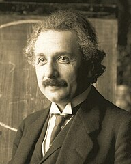

# Albert Einstein

Albert Einstein was a German-born theoretical physicist who is best known for developing the theory of relativity.

1. 1879: Born on 14 March in Ulm, Germany
2. 1885-88: Attends a Catholic school
3. 1903: Marries Mileva Maric
4. 1922: Awarded 1921 Nobel prize for Physics.Publishes his first work on the unified field theory.
5. 1928: Diagnosed with a heart condition
6. 1955: With Bertrand Russell, draws up a manifesto against the nuclear threat. Dies at Princeton hospital

[Wikipedia](https://en.wikipedia.org/wiki/Albert_Einstein)
[Nobel Prize](https://www.nobelprize.org/prizes/physics/1921/summary/)